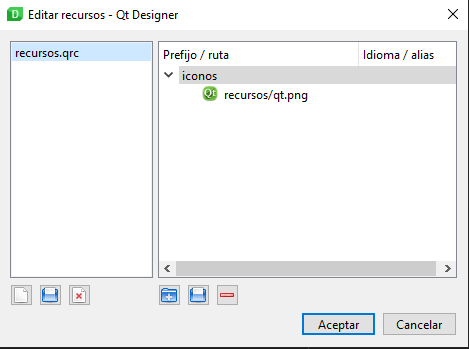

# 1.9 Diseño de interfaces en Qt Designer

En esta unidad se da por hecho que se tiene en el path el designer, rcc y uic.

- 1.9.1 Conceptos básicos de Qt Designer (layout, elementos, tamaños, expandir, recursos, experimentar...)
- 1.9.2 Compilación y uso de interfaces con UIC
- 1.9.3 Compilación y uso de recursos con RCC
- 1.9.4 Manejo de subventanas compiladas
- 1.9.5 Carga de interfaces sin compilar con QUiLoader

<!-- # 1.10 Qt Creator

- Probar si se puede usar en Linux
- En mac y windows se puede, la unidad se realiazará en Windows 10

## 1.10.1 Primer contacto

Descarga del instalador de Qt https://www.qt.io/download-qt-installer, hace falta registrar una cuenta en Qt y completar el proceso a través del email recibido:

### Instalación

- Open Source Obligations > Marcar que somos "Personas Individuales"
- Installation Folder > Por defecto
- Select Components > Por defecto

Siguiente siguiente hasta el final y damos permisos... No sé como es la

Tardará un buen rato en instalarse, son unos 800 megas.

### Primera ejecución

Al abrir `Qt Creator` por primera vez nos encontraremos un proyecto vacío, vamos a ir a:

- `File`
- `New File or Project`
- `Application Qt for Python`
- `Qt for Python - Window`

Lo vamos a llamar `P01QtCreator`, nos pedirá que configuremos la ventana. Vamos a indicarle lo siguiente, siguiendo la lógica que hemos aprendido durante todo el curso:

En principio Qt Creator debería detectar el Python de nuestro sistema, y si tenemos PySide2 ya instalado nos pedirá instalar otro módulo llamado `PyLS` en la parte superior presionamos, presionamos `Install`.

Como veréis se ha creado un proyecto automáticamente, cuyo fichero principal es `programa.py`, con una ventana de la clase `MainWindow` que hereda de la clase `QManWindow`, todo exactamente como hemos aprendido en el curso.

Si presionamos `Control+R` o el botón verde `Play` de abajo, lanzaremos el programa.

Haciendo clic en el directorio del proyecto, en nuestro caso `programa` seleccionaremos la opción:

- `Add New`
- `Qt`
- `Qt Designer Form`

Se abrirá un editor, seleccionaremos:

- `Main Window`
- `Next`
- `mainwindow.ui`, en el directorio del proyecto.

Al añadir el fichero se abrirá automáticamente la vista del diseñador, esta es la gracia de utilizar Qt Creator.

Vamos a arrastrar un `layout vertical` al diseño desde la izquierda, a la derecha poddemos observar que automáticamente se establece en una jerarquía como hijo de centralWidget.  -->
