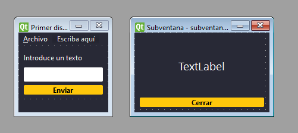
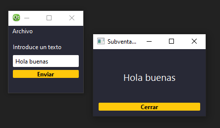

# 1.9 Diseño de interfaces con Qt Designer

- 1.9.1 Nuestro primer diseño
- 1.9.2 Compilación y uso de diseños con recursos
- 1.9.3 Añadiendo funcionalidades al diseño
- 1.9.4 Gestión de múltiples diseños

En esta unidad se da por hecho que se tiene en el path el designer, rcc y uic.

## 1.9.1 Nuestro primer diseño

Muy bien, pues vamos a diseñar nuestra primera interfaz. Si tenemos el directorio de PySide6 en el PATH del sistema podemos abrir el programa escribiendo:

```bash
designer
```

### Primer formulario

Lo primero es seleccionar qué tipo de formulario crear, vamos a crear una ventana principal `Main Window`.

- En el centro tenemos la vista de diseño con la ventana principal.
- A la izquierda tenemos la caja de Widgets.
- Arriba el control de elementos y disposiciones.
- A la derecha encontramos de arriba a abajo:
  - El inspector de objetos en una vista jerárquica.
  - El editor de propiedades del componente seleccionado.
  - Y el navegador de recursos del programa.

### Personalizar la ventana

Vamos a empezar a personalizar la ventana usando algunas propiedades:

- `geometry`: 480 ancho y 320 alto
- `windowTitle`: Primer diseño

Ahora vamos a crear un conjunto de recursos para utilizarlos en el programa.

- Hacemos clic en el `lápiz` del navegador de recursos.
- En la columna izquierda clic derecho > `Nuevo`.
- En el directorio de la aplicación guardamos el fichero con el nombre `recursos`.
- Con `recursos.qrc` seleccionado, clic derecho en la columna derecha > Nuevo prefijo.
- Le damos por ejemplo el nombre `iconos`, clic derecho `Añadir archivos`.
- Buscamos un icono png para ponerlo en nuestra ventan, lo añadimos y aceptamos.


- `windowIcon`: Desplegamos, "Elija recurso" y seleccionamos el icono.

* Guardamos el diseño `Control+S` con nombre `mainwindow.ui` en un directorio llamado, por ejemplo `interfaces`.

- Presionamos `Control+R` para ver una previsualización de la ventana principal.

### Componentes y disposiciones

Vamos a añadir algunos elementos:

- `Label`: Introduce un texto
- `LineEdit`
- `PushButton`: Enviar

Veréis que no quedan muy bien dispuestos, eso es porque nuestra ventana no tiene un layout establecido.


Con la ventana seleccionada hacemos clic en el layout vertical de la barra superior, automáticamente los elementos se posicionarán siguiendo esta disposición:


Automáticamente se creará un dummy widget con un layout para el `centralWidget` y los componentes se posicionarán automáticamente. Además ahora encontraremos un nuevo apartado `Layout`en las propiedades del objeto `centralWidget` donde podemos cambiar su configuración.

Sin embargo veréis que nuestros elementos se posicionan raro porque la etiqueta se expande por defecto.

Para solucionar esto vamos a añadir abajo del todo un widget `Vertical Spacer`:


Como podéis suponer los `Spacers` rellenan automáticamente el espacio sobrante de un layout.

Podemos probar otras disposiciones hasta encontrar una que nos guste y utilizar el botón `Ajuste de tamaño` para redimensionar el tamaño de la ventana acordemente a su contenido:


Otra cosa importante es que las ventanas principales vienen con su `menuBar` y `statusBar` ya creadas.

Podemos agregar campos al menú superior simplemente escribiendo ahí. Luego podemos gestionar las acciones mediante el inspector de objetos y de propiedades. Cualquier cosa que debáis configurar de un widget la encontraréis ahí, por ejemplo podemos añadir un acceso directo al botón de &Salir del menú:


Y añadir una imagen al botón de salir, siempre que préviamente la añadamos a nuestros recursos:


Si añadimos `statusTips` a nuestros componentes, se mostrarán automáticamente en el previsualizador:


También podemos cambiar los estilos del programa haciendo clic derecho en el objeto `MainWindow` del inspector y con la opción `Cambiar Hoja de Estilos`.

Se abrirá un formulario donde podemos pegar todo el contenido de nuestro fichero QSS tradicional:


Y creo que ya hemos visto todos los conceptos clave.

En el segundo bloque del curso diseñaremos algunos programas, pero el mejor maestro es la práctica. Os aconsejo perderos un rato probando layouts, widgets y cambiando sus propiedades para aprender por vuestra cuenta.

En la próxima lección vamos a transformar este diseño en un fichero Python para empezar a trabajar con él.

## 1.9.2 Compilación y uso de diseños con recursos

Para importar nuestros diseños en Python debemos transformarlos a código Python, eso se consigue compilando los diseños.

Para este fin se requiere de un programa intermediario de la Suite Qt llamado `uic`: User Interface Compiler.

Si añadimos el directorio de `PySide6` al path deberíamos poder acceder a él desde la terminal:

```bash
uic -h
```

El comando para compilar un diseño es:

```bash
cd 1-9-2/interfaces
uic.exe -g python mainwindow.ui -o mainwindow.py
```

Así habremos generado un fichero `python` dentro de la carpeta interfaces. Si lo analizamos encontraremos varias importaciones y todo el código para generar la ventana:

```python
from PySide6.QtCore import *
from PySide6.QtGui import *
from PySide6.QtWidgets import *

import recursos_rc
```

Quiero que os fijéis en la línea `import recursos_rc`. Esta línea es la que va a cargar los recursos compilados del diseño. Esos recursos deberán estar en el módulo `recursos_rc` de la propia carpeta, así que necesitamos crearlos.

Compilar los recursos es un proceso calcado a compilar los diseños, pero esta vez se utiliza otra herramienta de Qt llamada `rcc`: Resource Compiler.

El comando para compilar los recursos es:

```bash
cd 1-9-2
rcc.exe -g python -o recursos_rc.py recursos.qrc  # mismo directorio
```

Esto tomará el fichero `recursos.qrc` que habíamos creado en `Qt Designer` y lo compilará. Fijaros como el nombre debe concordar con el módulo que espera encontrar la ventana principal.

Ahora los iconos del programa se encuentran compilados en el fichero `recursos_rc.py`. Nuestro programa los tomará de ahí en lugar de utilizar las imágenes del directorio `recursos/`.

Llegados a este punto es hora de crear un programa con PySide e importar el diseño. La lógica de creación de la ventana principal es la siguiente:

```python
from PySide6.QtWidgets import QApplication, QMainWindow
from interfaces.mainwindow import Ui_MainWindow
import sys

class MainWindow(QMainWindow, Ui_MainWindow):
    # Heredamos de QMainWindow y de la interfaz

    def __init__(self):

        # Llamamos al constructor explícito de QMainWindow
        QMainWindow.__init__(self)

        # Ejecutamos el método setupUi heredado del diseño,
        # gracias al cual se generará la interfaz gráfica
        self.setupUi(self)

if __name__ == '__main__':
    app = QApplication(sys.argv)
    window = MainWindow()
    window.show()
    sys.exit(app.exec_())
```

Vamos a ejecutar el programa a ver si todo funciona bien:

- `Widgets` -> Ok
- `Estilos` -> Ok
- `Recursos` -> Ok
- `Tips` -> Ok

Ya lo véis, fácil, rápido y para toda la familia.

En la próxima lección vamos a añadir funcionalidades al diseño.

## 1.9.3 Añadiendo funcionalidades al diseño

Para interactuar con los componentes de la interfaz debemos acceder a ellos a partir de sus nombres de objeto, que aparecen en el inspector de objetos de Qt Designer. Podemos cambiar los nombres haciendo doble clic en ellos o utilizar los que crean por defecto.

Una vez tenemos los nombres es tan sencillo como manejar nuestras propias instancias:

```python
from PySide6.QtWidgets import QApplication, QMainWindow, QMessageBox  # edited
from interfaces.mainwindow import Ui_MainWindow
import sys

class MainWindow(QMainWindow, Ui_MainWindow):
    def __init__(self):
        QMainWindow.__init__(self)
        self.setupUi(self)

        # configuramos una señal para el botón
        self.pushButton.clicked.connect(self.mostrar_mensaje)

    def mostrar_mensaje(self):
        QMessageBox.information(
            self, "Diálogo", f"El contenido del campo de de texto es:\n\n{self.lineEdit.text()}")

if __name__ == '__main__':
    app = QApplication(sys.argv)
    window = MainWindow()
    window.show()
    sys.exit(app.exec_())
```

En cuanto a la acción para salir del programa, podemos recuperarla y establecer su señal tal como aprendimos al manejar los menús:

```python
# configuramos la señal de la acción para salir del programa
self.action_Salir.triggered.connect(self.close)
```

Con esto podremos cerrar la aplicación también haciendo servir el acceso directo `Control+Q` que configuramos en el diseñador.

Como véis los diseños compilados se utilizan como un programa normal, solo que la parte de generar la estructura se realiza en el fichero de diseño, un fichero que por cierto, nunca debemos editar, ya que tal como avisa en los comentarios superiores, si recompilamos la interfaz todos los cambios se perderán:

```python
# WARNING! All changes made in this file will be lost when recompiling UI file!
```

Además es buena idea tener la lógica del programa separada del diseño, esto se conoce más o menos como patrón Modelo-Vista, teniendo en el modelo la lógica del programa y en la vista el diseño del programa.

Solo me falta mostraros cómo gestionar múltiples diseños, por ejemplo una ventana principal y una subventana ambas creadas con Qt Designer.

Lo vemos en la próxima lección.

## 1.9.4 Gestión de múltiples diseños

Supongamos que en lugar de mostrar un cuadro de diálogo queremos crear una subventana un diseñada con Qt Designer.

Vamos a crear algo sencillo tomando como base la clase `QWidget`:



Compilamos el diseñode la subventana:

```bash
cd 1-9-4/interfaces
uic.exe -g python mainwindow.ui -o mainwindow.py
```

Vamos a partir del programa de antes sin la señal del botón:

```python
from PySide6.QtWidgets import QApplication, QMainWindow
from interfaces.mainwindow import Ui_MainWindow
import sys

class MainWindow(QMainWindow, Ui_MainWindow):
    def __init__(self):
        QMainWindow.__init__(self)
        self.setupUi(self)
        self.action_Salir.triggered.connect(self.close)

if __name__ == '__main__':
    app = QApplication(sys.argv)
    window = MainWindow()
    window.show()
    sys.exit(app.exec_())
```

Importamos la subventana, creamos un nuevo widget a nuestro gusto heredando de `QWidget` y su diseño para poder llamar a su método `setupUi`:

```python
from interfaces.subventana import Ui_Form  # el diseño de un widget es un form

class Subventana(QWidget, Ui_Form):
    def __init__(self):
        # llamamos al constructor explícito de QWidget
        QWidget.__init__(self)
        # generamos la interfaz de la subventana
        self.setupUi(self)
        # señal para cerrar la subventana
        self.pushButton.clicked.connect(self.close)
```

Fijaros como la lógica es la misma, pero al heredar de `Qwidget` debemos llamar a su constructor explícitamente. Recordad que la diferencia entre una ventana principal y un widget es que los segundos no contienen componentes como los las barras de menus o de herramientas.

Ahora, para manejar esta subventana lo haremos exactamente igual que aprendimos en las unidades anteriores, creando una instancia de la misma y mostrándola al presionar el botón de la ventana principal:

```python
class MainWindow(QMainWindow, Ui_MainWindow):
    def __init__(self):
        QMainWindow.__init__(self)
        self.setupUi(self)
        self.action_Salir.triggered.connect(self.close)

        # creamos la subventana pero no la mostramos
        self.subventana = Subventana()
        # señal para abrir la subventana enviándole el texto del campo
        self.pushButton.clicked.connect(self.mostrar_subventana)

    def mostrar_subventana(self):
        # establecemos el texto de la ventana principal en la subventana
        self.subventana.label.setText(self.lineEdit.text())
        # y mostramos la subventana
        self.subventana.show()
```



Y ya lo tenemos.

Solo comentar algo, si hubiéramos creado un diálogo en Qt Designer deberíamos haber heredado de la clase `QDialog` en lugar de `QWidget`, tenedlo presento.

    NOTA: NO DECIR QUE SE ACABA LA UNIDAD NI NADA, DEJAR SIEMPRE LAS UNIDADES ABIERTAS
